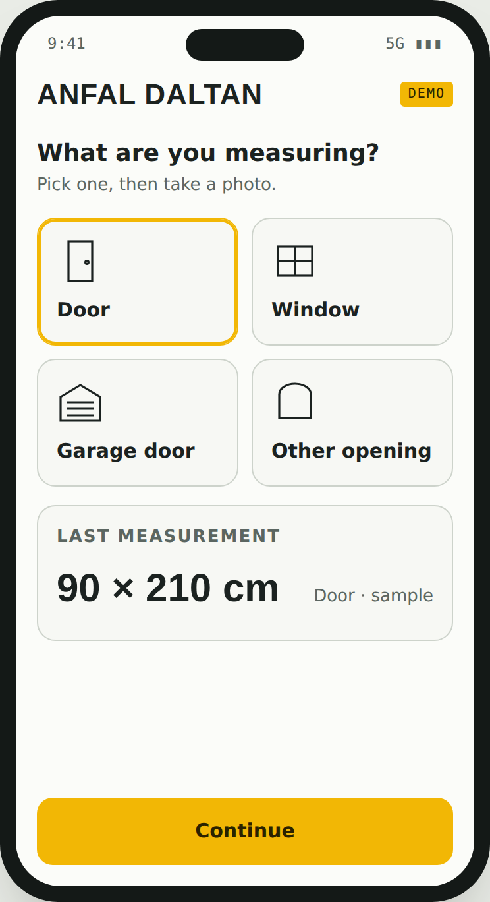
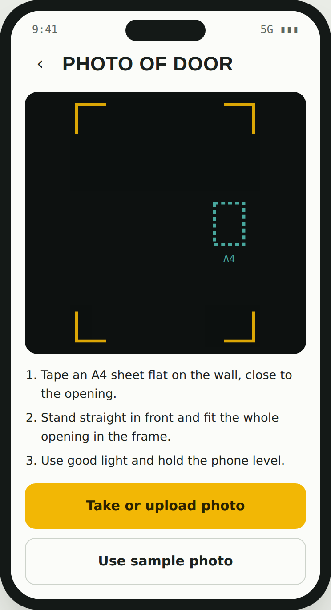
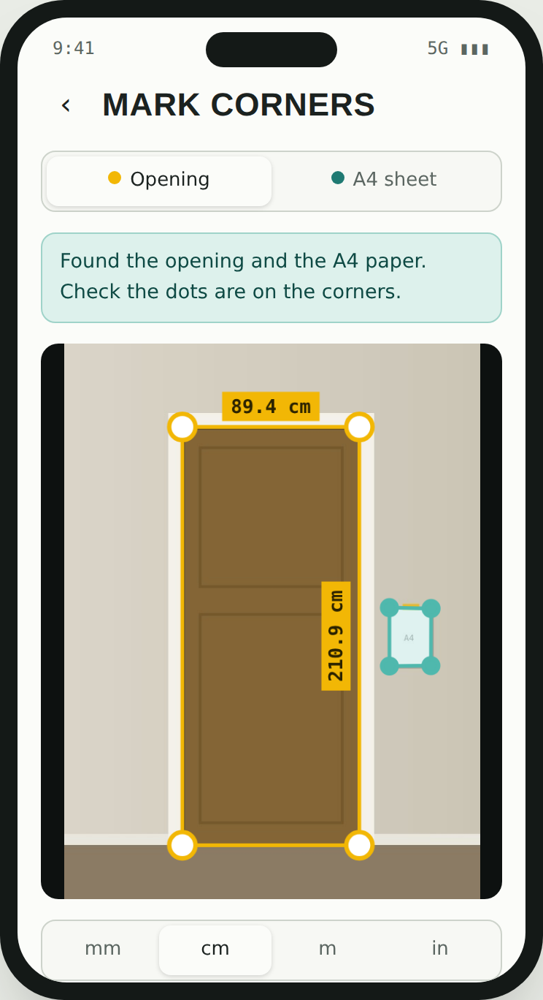
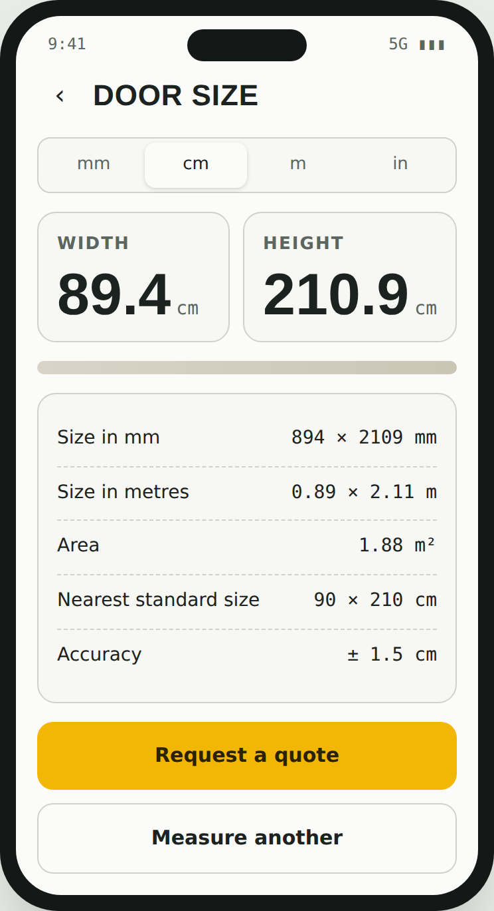

# Anfal Daltan – AI Door Measurement

A mobile web demo that measures a door, window or opening from **one photo**.
The customer tapes an A4 sheet (210 × 297 mm) on the wall next to the opening,
takes a photo, and the app returns the width and height in **mm, cm, m or inches**.

| Choose | Photo | Corners | Result |
|---|---|---|---|
|  |  |  |  |

**Live demo:** https://anfal-daltan.onrender.com

## Features

- Take a photo with the camera or upload one from the gallery
- Automatic detection of the door/window frame and the A4 sheet
- Fine-tuning of each corner with a magnifier and arrow buttons
- Units: mm, cm, m, inches; area; nearest standard size
- Warnings when the A4 sheet is missing or the dots are misplaced
- Works full screen on phones; can be added to the home screen

## How it works

1. **Find the A4 sheet** – looks for a bright, whiter or cooler rectangle with A4 proportions.
2. **Find the opening** – traces long vertical frame edges, pairs a left and right edge that share
   a horizontal top edge, and prefers the inner outline of the frame.
3. **Sharpen corners** – snaps each side to the strongest nearby edge on the full-size photo.
4. **Scale** – millimetres per pixel from the A4 sheet, then width/height of the opening.

Accuracy is about ±1–2 cm for a photo taken straight on in good light with the normal (1×) lens.

## Run locally

It is a single static file. Open `index.html` in a browser, or serve the folder:

```bash
python3 -m http.server 8000
# then open http://localhost:8000
```

## Deploy

Any static host works (Render, Netlify, GitHub Pages). On Render: New → Static Site,
build command `echo ok`, publish directory `.`.

## Roadmap

See [docs/Anfal-Daltan-Technical-Plan.pdf](docs/Anfal-Daltan-Technical-Plan.pdf) for the full
plan: trained AI models (YOLO segmentation and keypoints), AR measuring with ARKit/ARCore,
Flutter mobile app, backend and sales dashboard.
